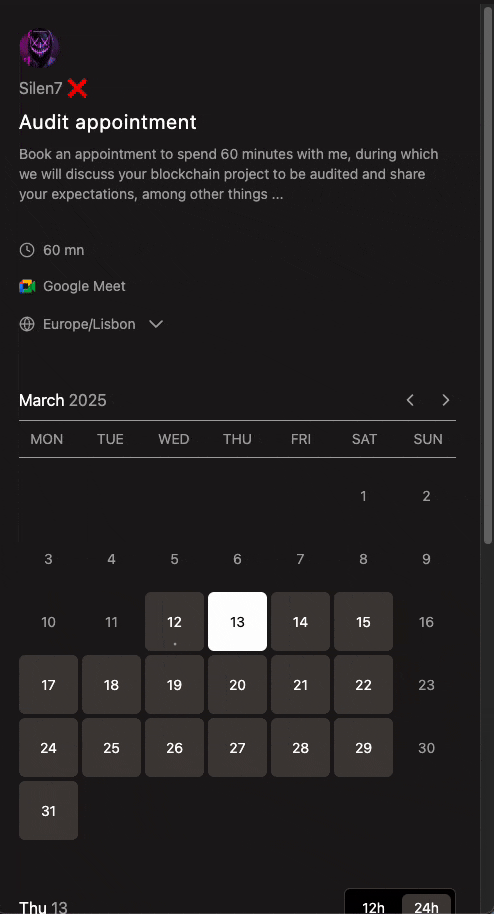
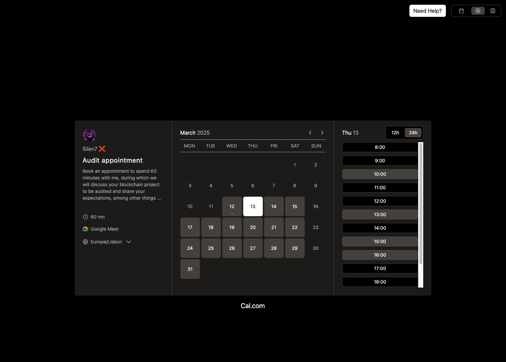

# 📅 Cal.com UI Clone

_A clean UI clone of Cal.com built with Tailwind CSS and Vite.js_

## 🎨 Technologies Used

- 🌀 **[Tailwind CSS](https://tailwindcss.com/)** – Utility-first CSS framework
- ⚡ **[Vite.js](https://vitejs.dev/)** – Lightning-fast frontend tooling

## 📸 Previews

<p align="center">
  
  <br>
  <br>
  
</p>

## 🚀 Features

✅ **TailwindCSS** for modern, utility-first styling  
✅ **Vite.js** for fast development & hot module reloading  
✅ **Fully responsive** design  
✅ **Clean and maintainable codebase**

## 🔧 Installation & Setup

1️⃣ **Clone the repository**

```sh
git clone https://github.com/silent7-x/calcom-clone
cd calcom-clone
```

2️⃣ **Install dependencies**

```sh
pnpm install
```

3️⃣ **Run the project**

```sh
pnpm run dev
```

4️⃣ **Open in your browser**

Vite will start a local server. Open **[http://localhost:5173/](http://localhost:5173/)** in your browser.

## 🌟 Contributing

Feel free to contribute! Fork the repo and submit a PR if you have improvements.

## 📩 Contact

💻 GitHub: [@silen7-x](https://github.com/silent7-x)

🐦 Twitter: [@silen7_x](https://x.com/silen7_x)
